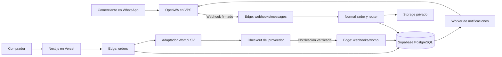

# Arquitectura propuesta — ApartaYa

Versión 0.1. Preserva la base existente del Sprint 0; describe capacidades futuras sin presentarlas como implementadas.

## 1. Componentes

El adaptador Wompi, la PWA, pedidos y notificaciones de dominio aún no existen. El worker actual solo recupera mensajes del eco.

## 2. Router y contratos

`NormalizedMessage`: sessionId, messageId, chatId opaco, type, text, occurredAt, media opcional y mediaOmitted. El normalizador implementado es el punto de entrada actual. La máquina de estados de negocio no debe conocer campos exclusivos del proveedor.

Interfaz propuesta de canal: `sendText(recipient,text,correlationId)`, `getMedia(messageRef)` y `health()`. El correlationId permite auditoría interna; no implica que el proveedor admita idempotencia. Un futuro adaptador Cloud API convierte a estos contratos sin reescribir reglas de pedidos.

Interfaz propuesta de pagos: `createCheckout(order)`, `verifyNotification(rawBody,headers)`, `fetchPayment(providerRef)`. Resultado neutral: referencia, orden, importe en centavos, moneda y estado. No asumir un algoritmo de firma, endpoints, OAuth ni campos de Wompi Colombia para El Salvador. Su contrato concreto necesita documentación oficial/cuenta de negocio y fixture de prueba.

## 3. Fronteras de confianza y rutas

- `/functions/v1/webhooks/messages`: ya implementada; HMAC OpenWA y sesión permitida antes de persistir.
- `POST /api/orders` en Next.js: fachada pública propuesta que recibe token de usuario verificado y reenvía a Edge con su JWT. No recibe ni utiliza service_role en Vercel.
- `POST /functions/v1/orders`: propuesta; verifica JWT e identidad del comprador, resuelve importe desde listing y aplica reserva atómica.
- `/functions/v1/webhooks/wompi`: propuesta; verificación contractual del proveedor, deduplicación y transacción. No existe aún.
- `/functions/v1/worker`: implementada para eco con secreto propio. El worker de dominio será ampliación posterior.
- `GET /[slug]`: proyección pública mínima del listing; no exponer tablas completas ni teléfonos.

Propuesta: Supabase Auth con OTP para verificar comprador antes de conceder contraentrega; servicio de entrega de OTP pendiente. Para el checkout inicial también se necesita asociar contacto verificado con destino del código. El teléfono normalizado debe tener vínculo probado con JID antes de enviar notificaciones a WhatsApp.

## 4. Transacciones que deberá implementar el dominio

El SQL adjunto crea estructuras y restricciones; no implementa las siguientes RPC todavía:

1. **Publicar:** serializar por comerciante, validar precio/foto, crear slug y evento único; encolar respuesta en la misma transacción. Evitar dos listings para el mismo recibo.
2. **Reservar:** bloquear listing, validar available, resolver idempotencia por comprador+clave, crear orden y cambiar listing a reserved. El índice parcial permite una sola orden activa por listing. Llamada externa fuera de la transacción; si el checkout queda incierto, conciliar antes de repetir.
3. **Confirmar pago:** bloquear orden y listing en orden consistente; comprobar referencia, importe y moneda; almacenar estado del proveedor y evento único; confirmar reserva y encolar avisos. `provider_ref` identifica transacción, pero un proveedor puede notificar varios estados de esa transacción; deduplicar también transición/evento sin descartar un éxito posterior a pending.
4. **Expirar:** bloquear órdenes vencidas con SKIP LOCKED; solo reabrir listing si pertenece a esa orden y no está vendido/deshabilitado; distinguir checkout vencido de no-show; crear eventos y recalcular score en la misma transacción.
5. **Entregar:** verificar propietario desde identidad del canal, comparar hash del código con intentos limitados y cambiar reserved → delivered una vez. También marcar listing sold, cancelar reminders y recalcular score.
6. **Notificar:** crear outbox dentro de transacción de negocio; worker con lease, revalidación de estado y recuperación. Error ambiguo requiere conciliación para no prometer exactamente una vez.

No autorizar escrituras directas desde PWA. Todos los importes y tiempos autoritativos provienen del servidor. El índice parcial no sustituye las transacciones ni implementa por sí solo las transiciones.

## 5. Variables de entorno

| Entorno | Variables |
|---|---|
| Edge existentes | SUPABASE_URL, SUPABASE_SERVICE_ROLE_KEY, OPENWA_BASE_URL, OPENWA_API_KEY, OPENWA_SESSION_ID, OPENWA_WEBHOOK_SECRET, WORKER_SECRET, BOT_SEND_ENABLED |
| VPS | OPENWA_MASTER_KEY; volumen persistente y configuración Baileys en Compose |
| PWA propuesta | NEXT_PUBLIC_SUPABASE_URL, NEXT_PUBLIC_SUPABASE_ANON_KEY, APP_ORIGIN |
| Edge futuras | WOMPI_* según contrato SV verificado; PUBLIC_APP_ORIGIN; parámetros comerciales versionados |

service_role vive solo en Edge en producción; el receptor Node actual es una herramienta local de desarrollo, nunca código cliente o despliegue Vercel. La PWA utiliza anon + RLS y JWT de usuario. Archivos .env ignorados, secretos en gestores del proveedor, nunca en SQL, fixtures ni conversaciones.

## 6. Datos y permisos

Tablas existentes: merchants, message_receipts y events (eventos del bot con recibo obligatorio). Extensión propuesta: buyers, bot_sessions, listings, orders, payment_transactions, domain_events, notification_outbox y settlement_entries.

`domain_events` evita convertir retroactivamente todos los eventos de negocio en mensajes WhatsApp. VENTAS y reportes consultan pedidos/transacciones, y los eventos sirven para reconciliación y métricas. Score derivado no sustituye historial.

El snapshot activa RLS y deniega anon/authenticated en las tablas privadas. No incluye aún proyección pública de listing ni endpoints autenticados del comprador. Storage continúa privado; proponer miniatura optimizada y URL firmada con vencimiento para páginas de producto. Nunca insertar service_role para solucionar falta de una política pública.

## 7. Despliegue y pruebas

Mantener `0001_init.sql` actual. El snapshot del kit se usa en base vacía aislada; convertir el delta en `0002_*` al implementar el dominio. Separar staging/producción. Despliegue remoto pendiente de cuentas.

Casos necesarios: dos compradores simultáneos; callback duplicado/desordenado; pago tardío tras nueva reserva; entrega vs expiración simultáneas; código ajeno; crash entre commit y notificación; usuario anónimo leyendo datos privados; foto inaccesible; score recalculado dos veces; comisión subsidiada contada una vez. Pruebas del esquema prueban restricciones, no certifican esos flujos aún inexistentes.

pg_cron para expiración/reminders y resumen diario a 19:30 local; en UTC, programar según conversión de zona y documentarla. Alertas de backlog, pagos en revisión y caída de sesión. El runbook existente contiene procedimiento pendiente de ensayo.
